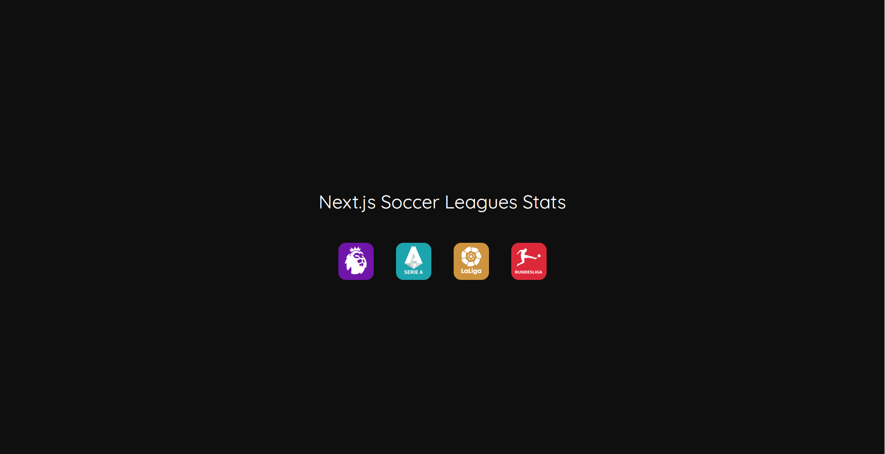
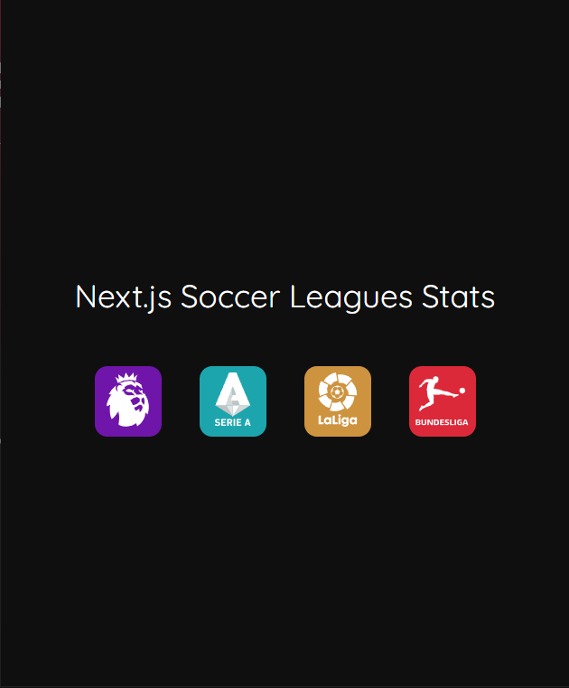
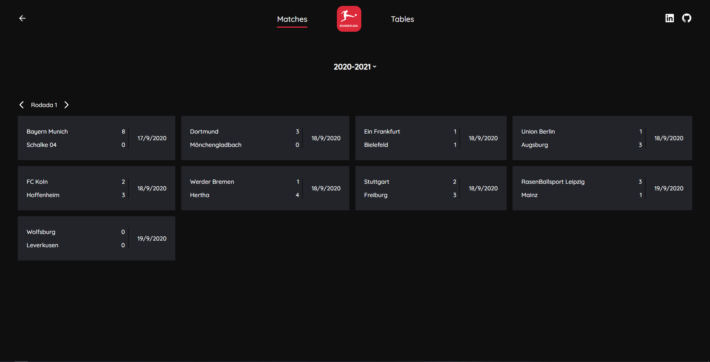
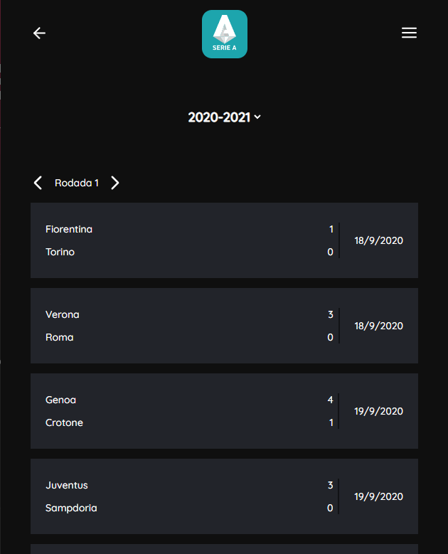
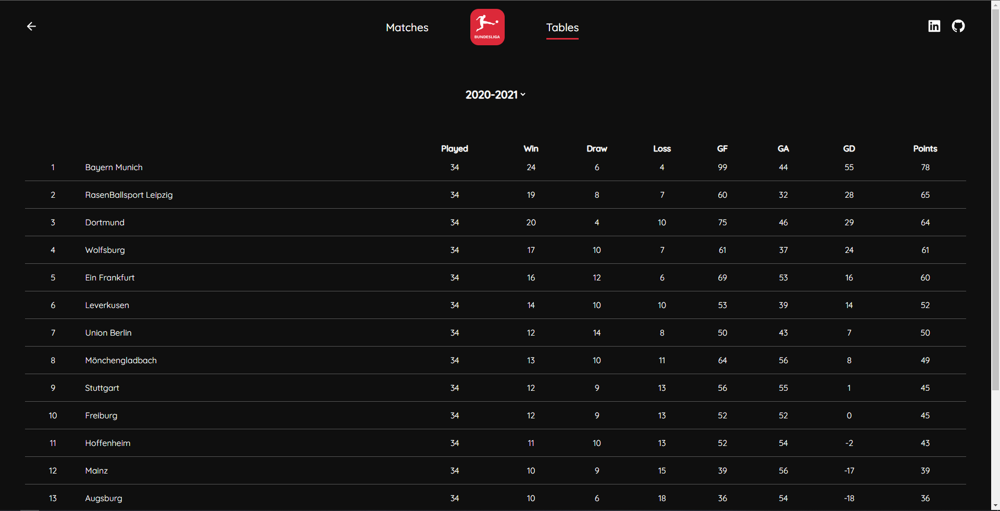
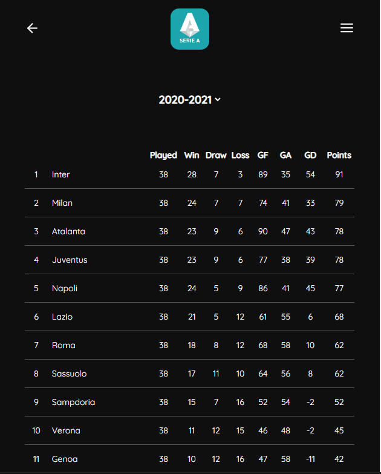

# Github User Finder

## Home

  
  

# Matches page

  
  

# Tables page

  
  

### Description
A Next.js project of a website where people can get matches results and tables from season 2014/2015 to 2020/2021 about four different european leagues:
* Premier League
* Italian Serie A
* La Liga
* Bundesliga
 
To get these information, I used [TheSportsDB API](https://www.thesportsdb.com/api.php)
  
### Tech:
* Next.js
* Typescript
* Sass
* Axios
* nextjs-progressbar
